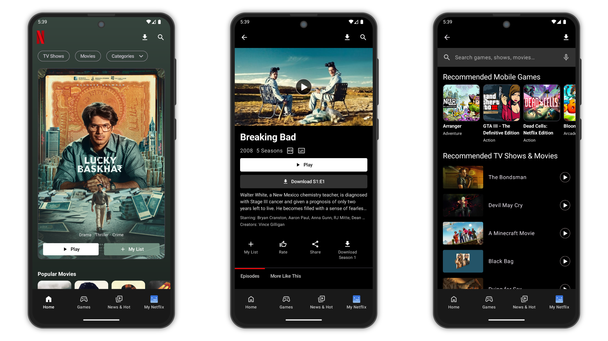
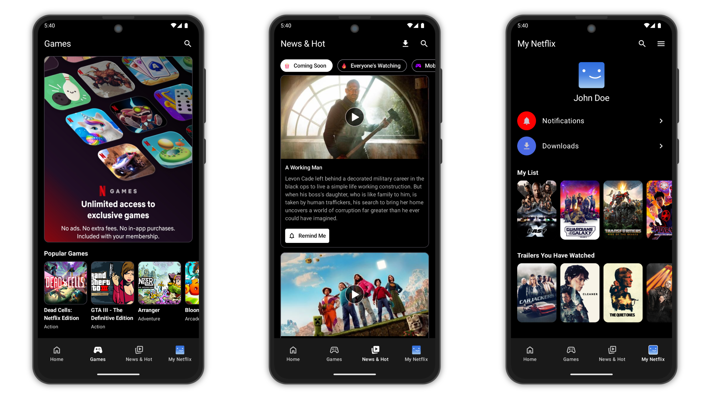

# Netflix Clone

**Netflix Clone** is a modern Android application built using **Jetpack Compose** that simulates the
core UI and functionality of Netflix. It allows users to explore trending, popular, and top-rated
movies and TV shows using real-time data fetched from **The Movie Database (TMDb) API**.

## Screenshots




## Features

### Movie & TV Show Browsing

- Browse trending, popular, and top-rated content from TMDb.
- Display media in paginated, scrollable lists using **Paging 3**.
- Fetch detailed movie/show info including overview, rating, poster, and release date.

### Deep Link Support

- Navigate directly to any movie or TV show screen using **deep links**.
- Great for integration with notifications and external sources.

### Offline Caching

- **Room Database** used to cache fetched content for offline access.
- Minimizes API calls and enhances performance.

### Clean Architecture

- **MVVM** design with separation of concerns across **UI**, **Domain**, and **Data** layers.
- Designed for scalability, testability, and readability.

## Tech Stack

- **Jetpack Compose** – Declarative UI framework
- **Paging 3** – Efficient data pagination
- **Room** – Local database caching
- **Retrofit** – API client for network requests
- **Deep Linking** – For direct navigation
- **Kotlin Coroutines + Flow** – For async and reactive programming
- **Material 3** – UI design

## Installation & Setup

1. **Clone the Repository**
   ```bash
   git clone https://github.com/yourusername/NetflixClone.git
   cd NetflixClone
   ```

2. **Get Your API Credentials**
    - Sign up at [https://www.themoviedb.org](https://www.themoviedb.org) and get:
        - **API Key (v3 auth)**
        - **Access Token (v4 auth)**

3. **Add Credentials to `local.properties`**
   ```properties
   TMDB_API_KEY=your_tmdb_api_key
   TMDB_API_TOKEN=your_tmdb_api_token
   ```

4. **Open the project in Android Studio**

5. **Sync Gradle and build the project**

6. **Run the app** on an emulator or a physical device

## Contribution Guidelines

1. Fork the repository
2. Create a new branch (`feature-branch-name`)
3. Commit your changes with meaningful messages
4. Push to GitHub and create a pull request

## Contact

For any queries or contributions, reach out
at [mubashirpa2002@gmail.com](mailto:mubashirpa2002@gmail.com)

## License

```
Copyright 2022 The Android Open Source Project

Licensed under the Apache License, Version 2.0 (the "License");
you may not use this file except in compliance with the License.
You may obtain a copy of the License at

    https://www.apache.org/licenses/LICENSE-2.0

Unless required by applicable law or agreed to in writing, software
distributed under the License is distributed on an "AS IS" BASIS,
WITHOUT WARRANTIES OR CONDITIONS OF ANY KIND, either express or implied.
See the License for the specific language governing permissions and
limitations under the License.
```
